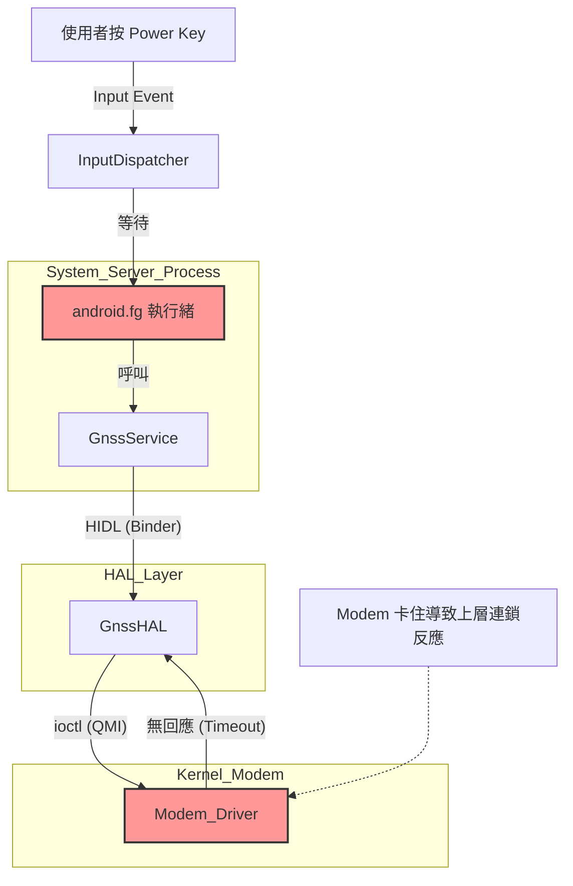

# Android ANR 與 GNSS Timeout 技術分析手冊

本文件旨在詳細解釋如何分析 Android 系統中因 HAL (硬體抽象層) 阻塞導致的 application Not Responding (ANR) 問題。以本次案例（Keypad 失效與 ANR）為例。

## 1. 問題概述 (Issue Overview)

*   **症狀**: 使用者發現按鍵 (Keypad) 無反應，隨後系統跳出 ANR 視窗，或是 Watchdog 導致系統重啟。
*   **根本原因**: 負責處理系統核心邏輯的 `android.fg` (Foreground Thread) 被 GNSS HAL 卡住 (Blocked) 超過 15 秒，導致無法響應輸入事件 (Input Events) 和廣播 (Broadcasts)。

---

## 2. 分析方法論 (Analysis Methodology)

分析此類問題通常遵循以下標準流程：

### 步驟一：定位 ANR 發生時間與進程

首先查看 `bugreport` 或 `logcat`，搜尋關鍵字 `ANR in` 或 `am_anr`。

```text
// 範例 Log
01-27 15:32:09.418 ... ANR in system (Reason: Broadcast of Intent { act=android.intent.action.SCREEN_ON ... })
```

*   **關鍵資訊**:
    *   **Process**: `system_server` (PID 1702) - 這是 Android 最核心的進程。
    *   **Reason**: `Broadcast of Intent { SCREEN_ON }` - 系統試圖喚醒螢幕時卡住。

### 步驟二：分析 Traces (Stack Trace)

找到對應時間點的 Trace 文件 (通常在 `data/anr/` 下)。重點觀察 `Subject` 行以及標記為 `Blocked` 的執行緒。

```text
// Trace 文件頭部
Subject: Blocked in handler on foreground thread (android.fg) for 15s
```

*   **關鍵執行緒**: `android.fg` (TID 1755)。
    *   這是 System Server 的前景執行緒，負責處理極高優先級的任務（如螢幕喚醒、按鍵分發）。如果它卡住，整個手機操作介面會凍結。

**深入 Stack Trace**:

```text
#00 pc 00000000000c12ec  /apex/.../libc.so (__ioctl+12)
#01 pc 00000000000686a8  /apex/.../libc.so (ioctl+156)
#02 pc 0000000000083a60  /system/lib64/libhidlbase.so (android::hardware::IPCThreadState::talkWithDriver(bool)+244)
...
#06 pc ... android.hardware.gnss@1.0.so (android::hardware::gnss::V1_0::BpHwGnss::_hidl_stop)
```

*   **解讀**:
    1.  `_hidl_stop`: 正在呼叫 GNSS HAL 的停止功能。
    2.  `talkWithDriver`: 透過 Binder/HIDL 機制與底層驅動溝通。
    3.  `__ioctl`: 這是 Linux 系統呼叫 (System Call)，用於對設備驅動發送控制命令。
    4.  **結論**: 執行緒正在等待底層硬體驅動的回應 (`ioctl` wait)，且已經等待超過 15 秒。

### 步驟三：關聯 System/Kernel Logs

一旦確認是 "GNSS HAL 卡在 Stop"，下一步是去 Logcat 搜尋與 GNSS 或 Location 相關的錯誤。搜尋關鍵字：`GNSS`, `Location`, `timeout`, `failure`。

```text
// 關聯 Log (時間點接近 ANR 前 15-20 秒)
01-27 15:31:51.818 ... W SWIGNSS : Function timed out
01-27 15:31:51.818 ... E SWIGNSS : stop failed, qcError 110
```

*   **解讀**:
    *   `SWIGNSS`: Qualcomm 的 GNSS 軟體模組。
    *   `Function timed out`: 明確指出函式執行超時。
    *   `qcError 110`: 這是 Linux Error Code 110 (`ETIMEDOUT`)，代表連線或請求超時。

---

## 3. 架構因果圖 (Causal Diagram)



## 4. 總結與建議 (Summary & Recommendations)

此次問題雖然表現為 "按鍵無效 (Framework 層)"，但根源在於 "Modem/GNSS (硬體/驅動層)"。

**建議除錯方向**:
1.  **檢查 Modem 狀態**: 確認是否有 Modem Crash (SSR) 或 QMI 通道擁塞的紀錄。
2.  **HAL Timeout 機制**: 檢查 GNSS HAL 實作，確保 `ioctl` 或 QMI 呼叫有設置合理的 Timeout (例如 2-3 秒)，避免讓 `android.fg` 這種關鍵執行緒卡死 15 秒以上。
3.  **非同步處理**: 考慮將 GNSS 的 Start/Stop 操作移至背景執行緒 (Background Thread)，不要在 Foreground Thread 執行。
